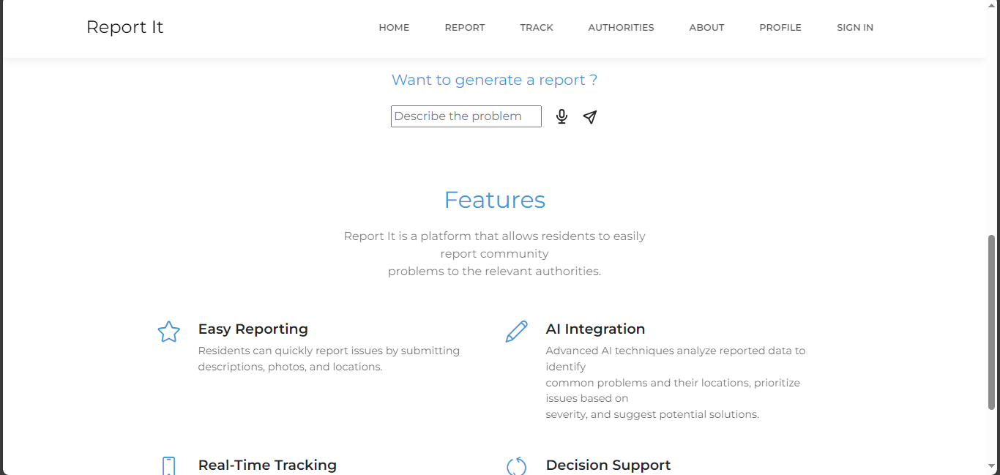
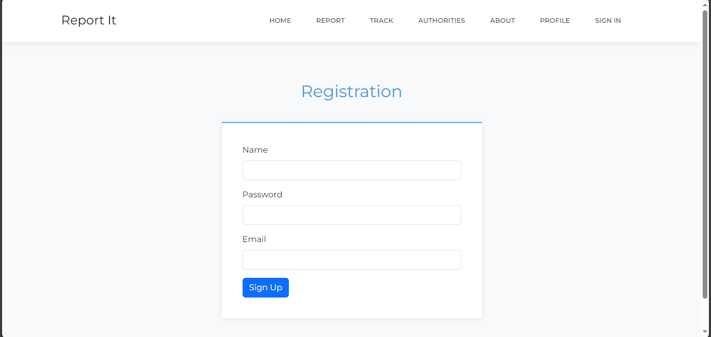

# A2SV-HACKERTHON-
# Report IT

## Table of Contents
- [introduction](#introduction)
- [Features](#Features)
- [Screenshots](#screenshots)

## introduction
In many communities specifically ours in Zambia , residents encounter various issues such as potholes, 
waste collection problems, broken streetlights, and other public nuisances that affect their quality of life.
However, the process of reporting these issues to the relevant authorities is often cumbersome and inefficient.
Many residents are unaware of the proper channels to report problems, leading to delays in addressing these issues. 

This project aims to develop a mobile application that allows residents to easily report community problems to the relevant authorities. 
By providing a user-friendly platform for reporting issues such as potholes and waste collection problems, 
the app seeks to streamline the communication between residents and authorities, ensure timely resolution of reported problems,
and enhance the overall quality of life in the community.

## Features
Easy Reporting: Residents can quickly report issues by submitting descriptions, photos, and locations.
AI Integration: Advanced AI techniques analyze reported data to identify common problems and their locations, 
prioritize issues based on severity, and suggest potential solutions.
Real-Time Tracking: Users can track the status of their reported issues and receive updates from authorities.
Image Recognition: AI-powered image recognition helps categorize and prioritize reported issues.
Predictive Analytics: AI analyzes historical data to predict and prevent future problems.
Decision Support: Provides authorities with data-driven insights to allocate resources effectively.

## Screenshots
### Desktop View
### Homepage

### Login

### Registration

### Report

### Track

### Admin Dashboard

### Admin Reports

### Authorites Permission

### Track

### Authorities Registration

### Create User

